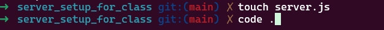

# server_setup_for_class

## Find your project


First we will navigate in our terminal to where we will be setting up our server
Here is where we will be installing Express(You MUST do this for every project)


With Express installed we can create our `server.js` and open VSCode


## Setting up our server.js
In our `server.js` file we are going to create our Express boilerplate.


```js
const express = require('express')
const PORT = process.env.PORT || 3001

const app = express()

app.listen(PORT, () => {
  console.log(`Express server listening on port ${PORT}`)
})

app.get(`/`, (req, res) => {
    res.send("You have set up your server.js")
})
```
Now we will head over to our `package.json` file
At the moment it should look something like this


In our terminal now we need to install nodemon
Which like Express is NEEDED every project

In our Terminal we are going to type 

```
npm install nodemon --save-dev
```

You will notice that devDependencies has been added to your `package.json`

The last step we must do is add the following to the "scripts" section of `package.json`
```
  "scripts": {
    "start": "node server.js",
    "dev": "nodemon server.js"
  },
```

This will allow us to make changes to our code and have them reflect upon refresh

## Testing the server

With everything set up we can finally check out our server

we will run 

```
npm run dev
```

The result will give something like this 


You can click "Open in Browser" and you server is working

